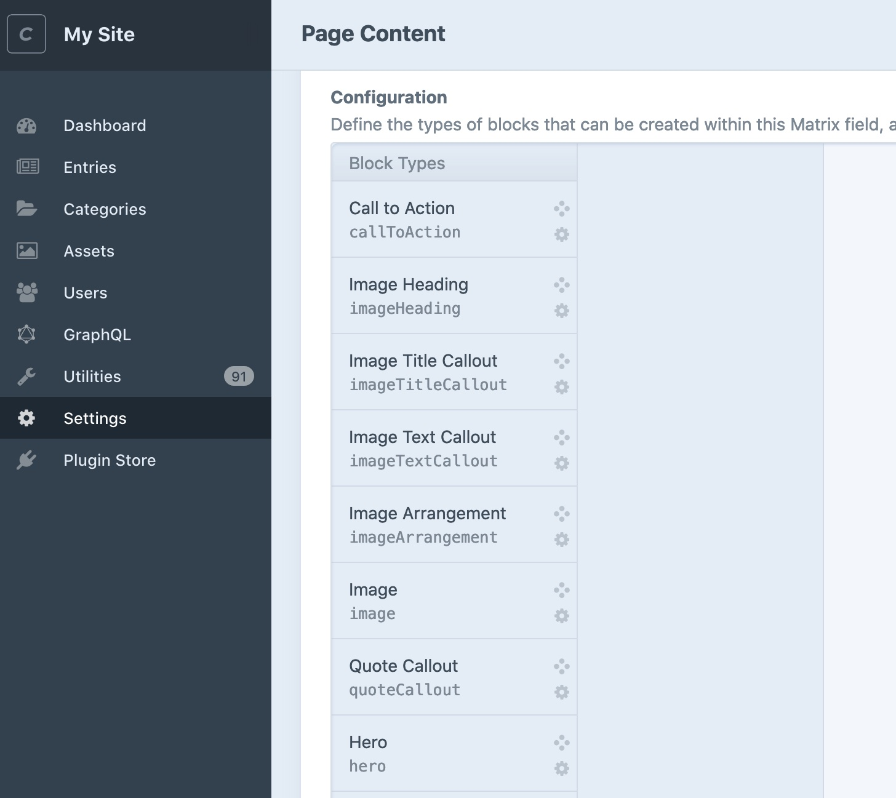
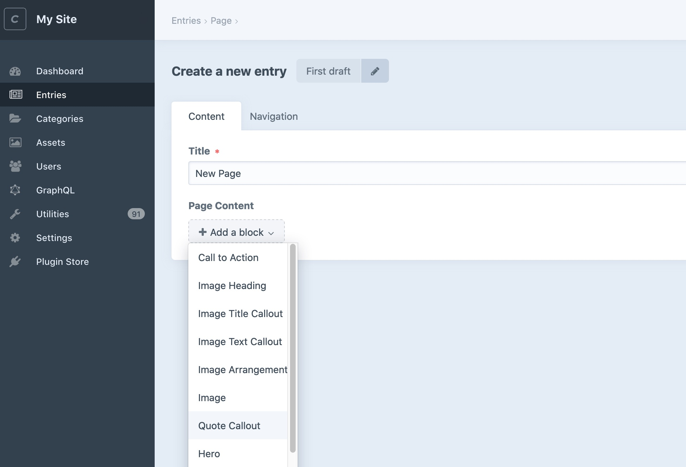
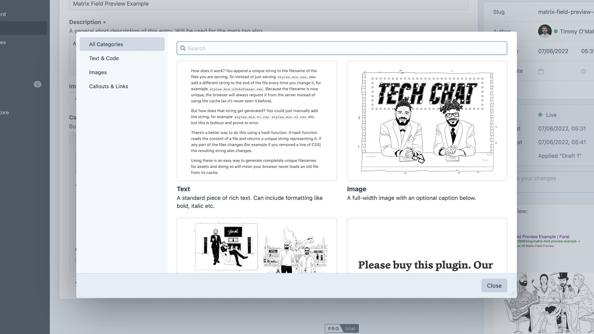
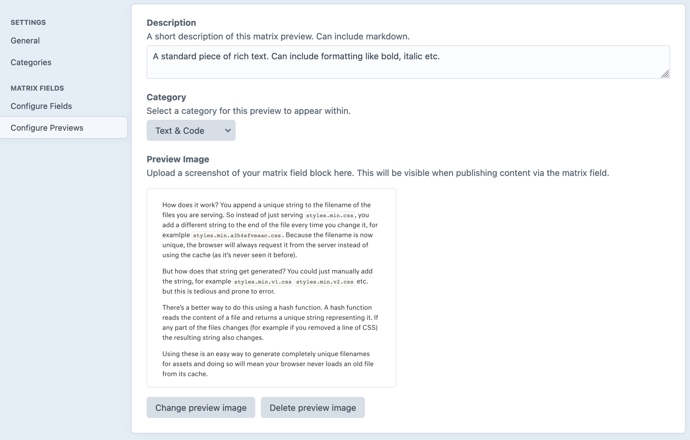
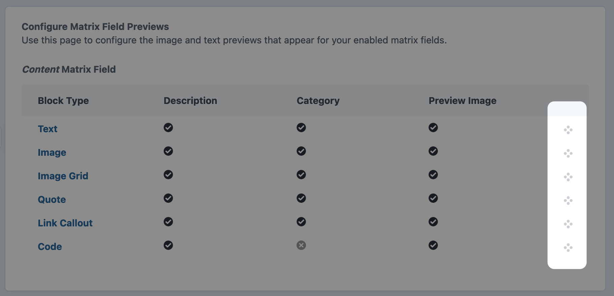
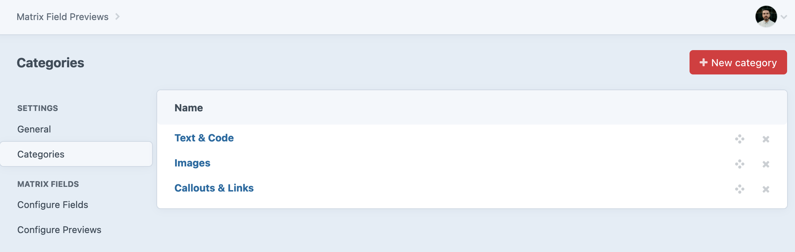
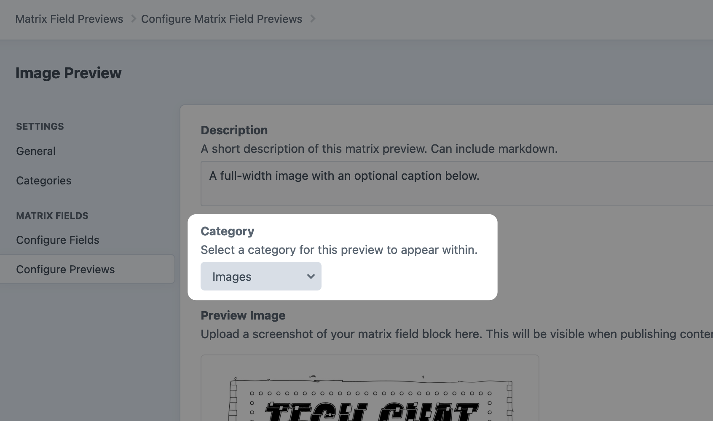

# Matrix Field Preview

Add text and screenshot previews to matrix fields, improving your client's publishing experience with visual prompts via an easy-to-use modal.

## Features

- Preview modal: view all your matrix field blocks via an intuitive modal right in the control panel.
- Categories: organise previews into sortable categories, making it easier to filter through and find blocks.
- Sorting: sort previews, placing the most-used ones at the top where they're quicker to find.
- Searching: search through previews, quickly finding what you need.
- Neo support: supports previewing of Neo fields as well as matrix fields.
- Supertable-aware: doesn't interfere with existing Supertable fields. 
- Spoon-aware: works alongside Spoon to improve the publishing experience.

## Background

For content-heavy websites, it makes sense to create a ["content builder"](https://nystudio107.com/blog/creating-a-content-builder-in-craft-cms) in Craft by using matrix fields to define a number of blocks that your client can use to publish content. This is really powerful but also leads to a confusing publishing experience. On big sites, you might have 10s of different blocks in a particular matrix field:

When your client goes to publish they'll see a huge dropdown:

There are a number of existing plugins like [Spoon](https://plugins.craftcms.com/spoon) and [Matrix Mate](https://plugins.craftcms.com/matrixmate) that help deal with this but as the number of matrix field blocks grows, even with descriptive block titles it can be tricky to figure out what a block will look like.

Craft Matrix Field Preview solves this by allowing you to upload screenshots of the rendered blocks so that your client can see at-a-glance what the content they are about to publish will look like.

When they publish new content, instead of using the native dropdown shown above, they'll get an overlay modal with examples:

As well as a preview on existing blocks.

## Requirements

This plugin requires Craft CMS 3.0.0 or later.

## Installation

To install the plugin, follow these instructions.

1. Open your terminal and go to your Craft project:

        cd /path/to/project

2. Then tell Composer to load the plugin:

        composer require weareferal/matrix-field-preview

3. In the Control Panel, go to Settings → Plugins and click the “Install” button for Matrix Field Preview.

## Configuration

Configuration is handled in the plugin settings page. There are three steps:

1. Configure the plugin.
2. Enable previews on your matrix fields.
3. Add previews to your matrix fields.

### Configure The Plugin

You can configure the plugin via the "General" tab in the plugin settings. Here you can select the volume and optional subfolder to place newly uploaded preview images (bear in mind you must have already configured a volume before configuring the plugin.)

### Enable Previews

Next configure which of your matrix fields you would like to enable previews for via the "Configure Fields" tab:

#### Takeover

By default, when you enable previews for a particular matrix field it will "takeover" the default user experience. This means that instead of seeing the default matrix field buttons, you will see a new "add block" button:

Alternatively, by disabling "takeover" you can have a separate complimentary "content previews" button appear in the control panel:

### Add Previews

Finally, configure the actual descriptions and previews for your matrix block types. 

This page shows at-a-glance which fields have been configured with previews. Click into each individual block type to set the description, category and/or preview image:

#### Sorting

You can sort the previews so that certain ones show up above others. This is useful for prioritising the most commonly used blocks, making them quick to find when publishing. See the "usage" section for more.

#### Categories

You can also group your previews into categories, making it easy for your publishers to find what they want. To create categories first go to the "Categories" tab. Here you can add and sort your categories:

You can then select your new categories when adding previews:

See the "usage" section for more.

## Usage

Once configured, you (and your client) will now see your previews live when they are editing content.

### Adding Content via Modal

If you go into your entries and click the "add block" of your matrix field, you will see a modal popup:

Here you will see:

- Categories: you can filter the matrix field block types via the various categories you configured in the previous step.
- Search: you can search for particular block types via their name or description.
- Expand: you can see larger previews of your images by clicking the small "expand" icon in the top right of each item.

### Inline Previews

You will also get an inline preview for all existing blocks. This inline preview has a hover-over effect that will give the client a larger preview of what the block looks like.

## Neo Support

Craft Matrix Field now support [Craft Neo Fields too](https://github.com/spicywebau/craft-neo)! When you have Neo installed, you can configure your Neo field just like you would Matrix fields:

**Bear in mind that you need to be using Neo >= 2.8.14 for Matrix Field Preview to work with Neo.**

## Support & Troubleshooting

If you have any problems please leave an issue on Github or find us on the Craft Discord (username `timmy`).
